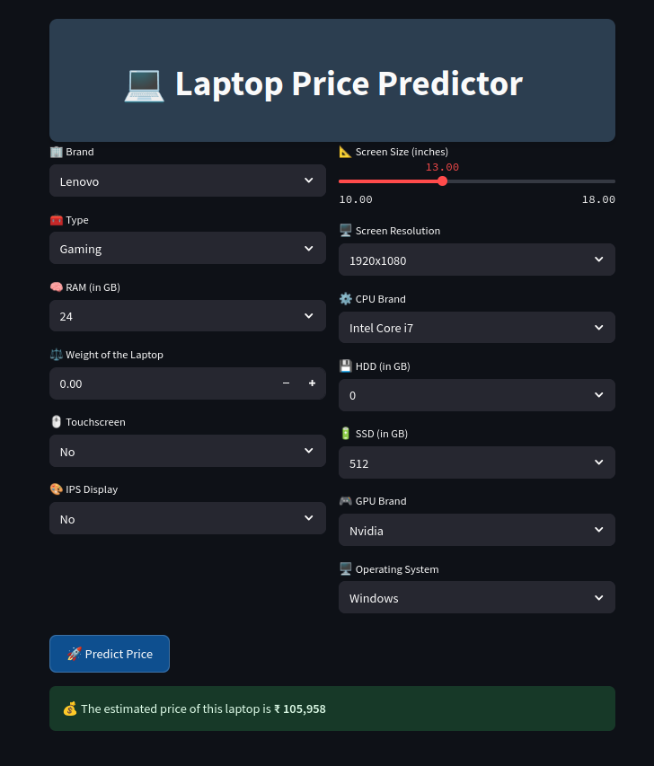

# 💻 Laptop Price Predictor
Accurate Laptop price prediction involves expert knowledge, because price usually depends on many distinctive features and factors. Typically, most significant ones are brand and model, RAM, ROM, GPU, CPU, etc. We applied different methods and techniques in order to achieve higher precision of the used laptop price prediction.




## 🚀 Demo

Try the live app here 👉 [https://laptop-price-prediction-onsrajhi.streamlit.app/]

📈 Processes

   1. Data Collection: Collected a dataset of laptops with various specifications and their prices.
   2. Data Cleaning: Handled missing values, outliers, and performed feature engineering.
   3.Exploratory Data Analysis (EDA): Analyzed the data to understand the relationships between different features and the price.
   4. Model Training: Split the data into training and testing sets and trained the model using multiple linear regression.
   5.Evaluation: Evaluated the model's performance using metrics like Mean Absolute Error (MAE) and Root Mean Squared Error (RMSE).

📊 Techniques & Concepts:

 While working on this project, I utilized various techniques and concepts to ensure data quality and enhance model performance. For data cleaning, I employed regular expressions (regex) to handle inconsistencies and remove unwanted characters. To visualize and analyze the data, I created various graphs such as boxplots and histograms, which helped in identifying and predicting outliers. These outliers were subsequently removed using the Interquartile Range (IQR) method and the mean variance approach. 
Additionally, I analyzed multicollinearity and correlation among the features to ensure that the model was not negatively impacted by highly correlated variables. To address the issue of left-skewed price data, I applied a log transformation, which helped in normalizing the data and improving the overall model performance.

🔑 Key Takeaways: 
• Understanding the impact of different features on laptop pricing. 
• Improved my skills in data preprocessing, feature engineering, and model evaluation.
• Gained insights into the practical application of regression models.


## 💼 Project Structure

laptop-price-predictor/
│
├── app.py # Streamlit web app
├──laptop-prediction.ipynb
├── pipe.pkl # Trained ML pipeline (scikit-learn + model)
├── df.pkl # Processed DataFrame (used for encodings)
├── requirements.txt # List of dependencies
├── README.md # Project documentation
└── .vscode/ # VS Code settings (optional)

## 🛠️ Installation

To run locally:

1. **Clone this repository:**

```bash
git clone https://github.com/yourusername/laptop-price-predictor.git
cd laptop-price-predictor

